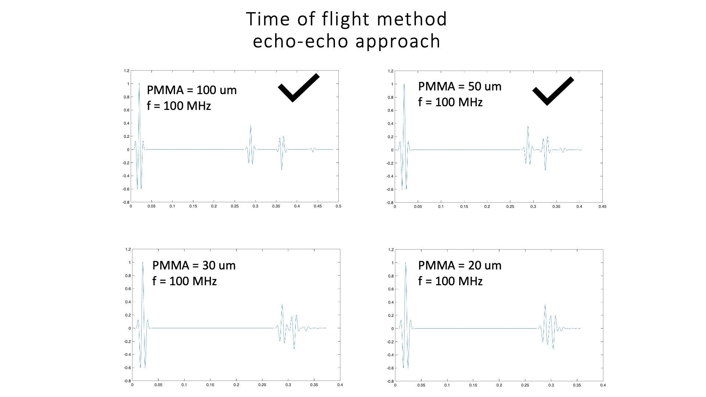
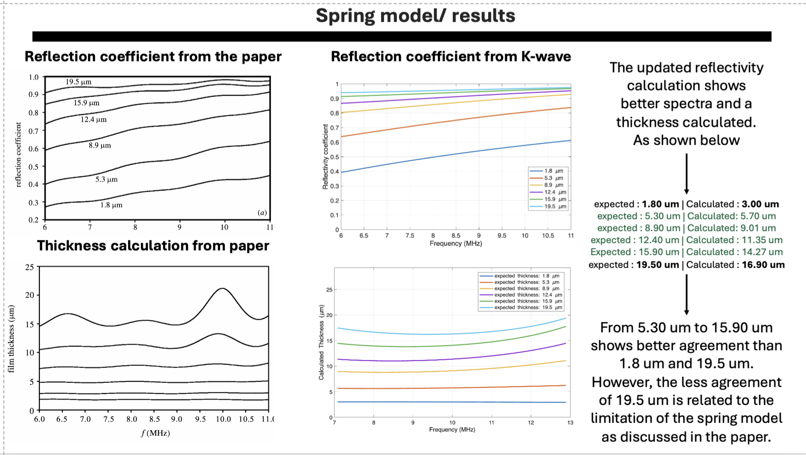

# Acoustic simulation in k-Wave
The first k-Wave simulation is mainly focused on studying the limitations of measuring the thin film thickness and acousitc/mechanical prepertes using the ToF. 
This simulation will help us understand the influence of different acoustic impedances using different polymer layers on the time of flight and link that with the ultrasound frequency. It is a 1D simulation.

The simulation script: Pulse_echo_Simulation_water_glass_film_glass_1.m

The second simulation is mainly focused on the influence of the thin polymer on the reflected echo, and it was compared with the reference, such as a glass substrate, and the simulation was tested with different sampling rates. 

The simulation script: MultiLaylerSimulation_2.m

In the third simulation, we used a spring model to measure the thin film of the polymer using the pulse-echo method. The method was implemented as discussed in the following paper: https://royalsocietypublishing.org/rspa/article-abstract/459/2032/957/81361/The-measurement-of-lubricant-film-thickness-using?redirectedFrom=fulltext
The k-wave simulation results are comparable to the original results from the paper, as shown in the figure below 

The two simulation was preforem, firt one is known as the reference simulation to collect the echo from the second interface of the glass, and the second simulation is related to collecting the echo from the glass-film interface, and the echo amplitude will abit change with thickness of the film. The uniqe in the sethod, we can measure the thin film using ultrasound waves in tens of MHz, but required the density and the velocity of the thin film for the calculation.
Th
The simulation script: Kwave_simulation_with_Spring_model.m

Note: Always remember to put the k-Wave toolbox in your path. 
